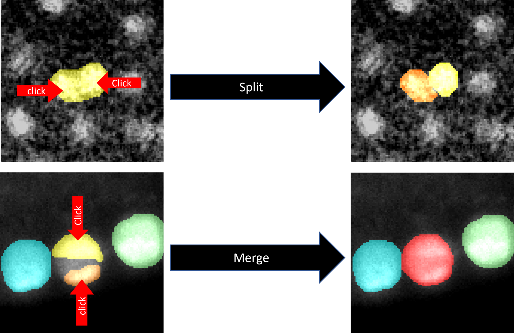

# NIS3D
A Completely Annotated Benchmark for Dense 3D Nuclei Image Segmentation.

## Introduction
NIS3D collects 6 large volume 3D embryonic nuclei images from the three most widely used species in the field with over 22,000+ manually annotated cells.

Here are examples of NIS3D. Each row represents a specific data, with columns from left to right displaying raw data, the annotated ground truth, and the corresponding confidence score map, respectively. Confidence scores indicate how many annotators out of three labeled this cell. The confidence scores are assigned on a four-level scale to show the reliability, from low to high: ''undefined masks'', ''1/3'', ''2/3'', and ''3/3''. These levels are labeled by the colors deep blue, light blue, yellow, and red, respectively. It's worth noting that ''undefined mask'' indicates regions with a group of very blurry cells that annotators can't decide their boundaries. The detection whose majority of pixels are within the undefined masks will be ignored, neither considered as true positive nor false positive.

 

## Advantage

- A good representation: NIS3D provides large-volume images of high cell densities, with nuclei whose signal-to-noise ratio, shape, and brightness vary with position. These properties make this benchmark challenging but well representative of data from real research.

- 3D complete annotation: All cells are annotated, and all labels are 3D. Compared with sparse annotation or 2D annotation, NIS3D can provide a more comprehensive evaluation, including the evaluation of false positives.

- Confidence score: A confidence score is computed for each cell, allowing more nuanced testing and performance comparison.

- Multiple species: NIS3D contains the three most commonly used species in this field (zebrafish, drosophila, and Mus Musculus) to provide enough diversity.

- Annotation tools: We designed a semi-automatic annotation tool, PrinCut, which significantly speeds up the workflow and reduces human bias when the boundary is weak.

## Annotation tool: PrinCut
The PrinCut GUI is shown in the figure below. PrinCut is a MATLAB app, and its package is also provided in the supplementary. The app is tested and used on MATLAB 2022b.

 

With the PrinCut, users can add a cell label by simply clicking the cell, and a 3D suggestive boundary will be automatically generated. We request the annotators check the suggestive boundary on every z slice to make sure it's correct. For example, if the suggestive boundary contains more than one cell, users can split the cell by clicking the center of each cell and PrinCut can give a suggestive boundary to each cell. However, there is a chance that the gap between two cells is too weak that the principal curvature is still negative. In this case, users need to use the brush to draw the expected boundary.

 

## Resource

**The paper can be found here:** *TBA*

**The dataset can be found here:** [*NIS3D*](https://drive.google.com/drive/folders/1LLI2-kW1Py90373WUO5FX7w7b0vIrKLE?usp=sharing).

The organization of NIS3D is shown in the figure below. Each folder contains 5 files, "Data.tif", "GroundTruth.tif", "ConfidenceScore.tif", "Visulize.tif", and "Info.txt". The "Data.tif" is the raw data. The "GroundTruth.tif" give the labels of ground truth. Different numbers in "GroundTruth.tif" represent different labels and 0 represents the background. "ConfidenceScore.tif" shows the confidence score map. The pixels belonging to the same label have the same confidence score. The value of "ConfidenceScore.tif" range from 0 to 4. 0 means background, 1 means undefined mask, 2 means 1/3 confidence score, 3 means 2/3 confidence score, and 4 means 3/3 confidence score. "Visulize.tif" shows the raw data, the ground truth labels, and the confidence score at the same time, which is the same as Figure 1 of the main paper. The "Info.txt" gives a brief description of the data and the link to the original paper of the data for more detail information. The tif file is a widely used format in the field. The software Fiji is one popular option to open and view tif files. 

 

**The annotation tool can be found here:** [*PrinCut*](https://drive.google.com/drive/folders/1iKrQtGZO3NGYLe-UPaejNIy6mL8UFrTi?usp=sharing).
